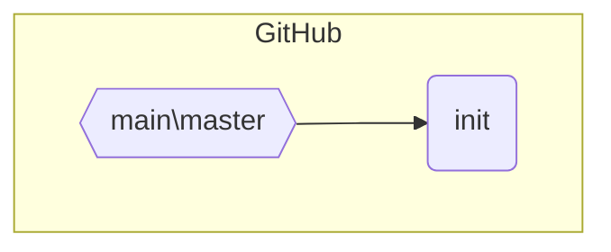
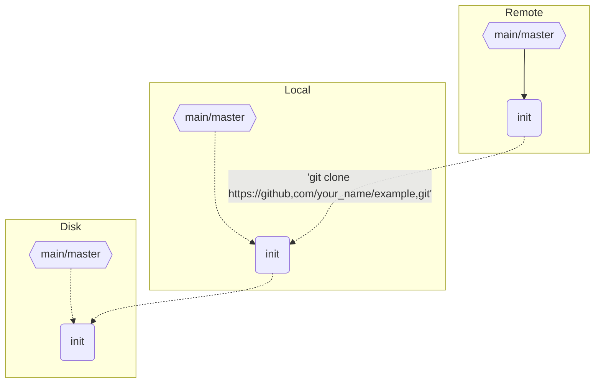
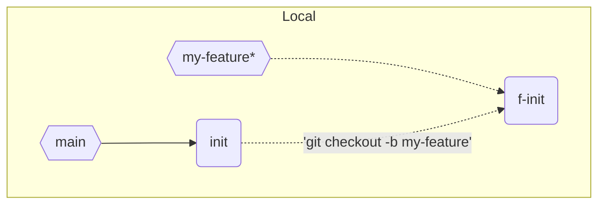
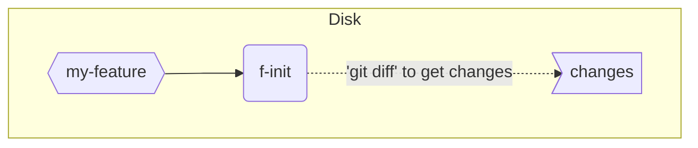
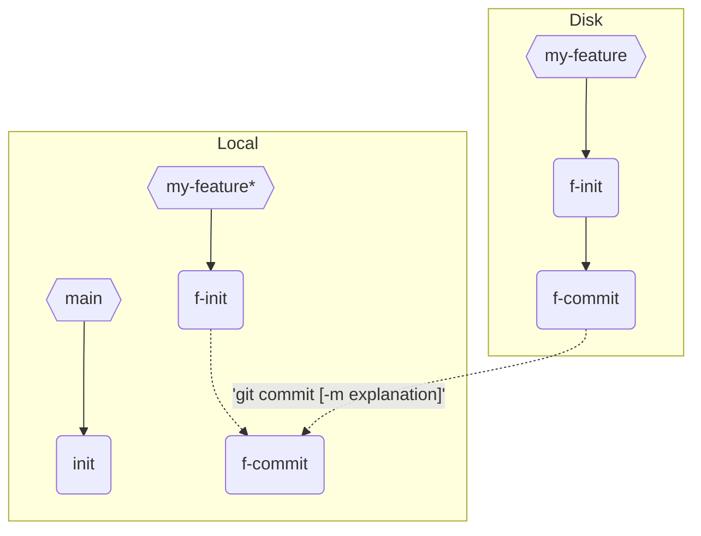
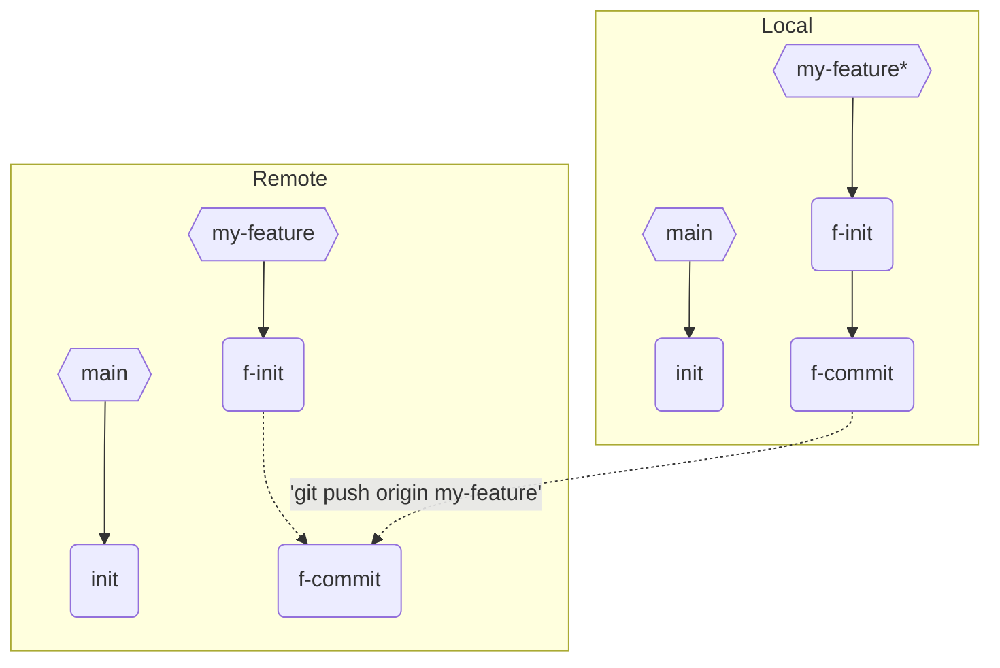
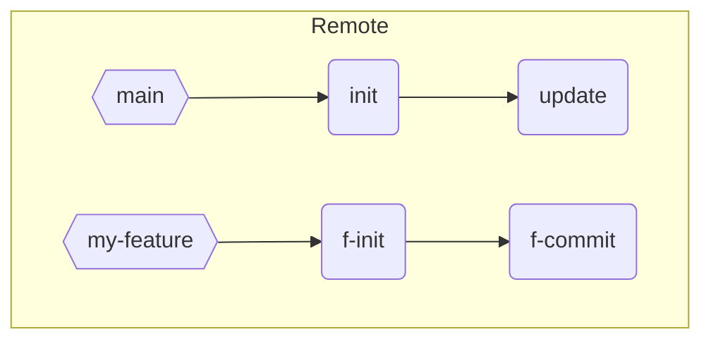
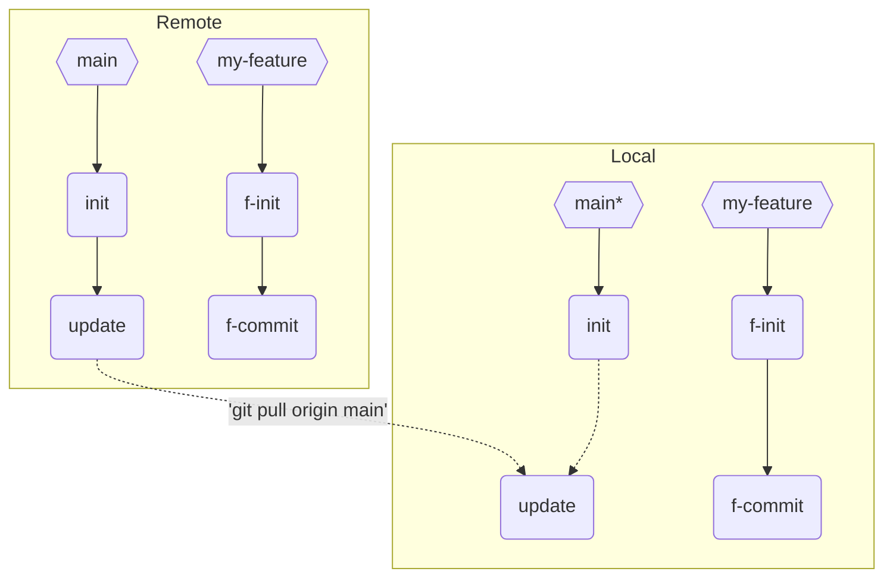
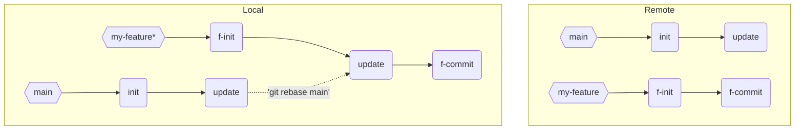

## 介绍   
还在`clone`、`commit`、`push`无脑管理项目吗，到时候bug都甩锅。  
来无废话，纯干货，掌握严谨的***GitHub工作流***，维护`个人项目`和参与`开源项目`都嘎嘎好用。  
## 来源
> 免责声明：  
> 本人不常用git，见[关于](https://yumeiing.github.io/about.html)。  
> 有错误还请见谅。。。  

源自bilibili[码农高天的视频](https://www.bilibili.com/video/BV19e4y1q7JJ/)，原视频讲得很生动详细，但我也会尽力做一些补充。  

## 流程
### 开始（拷贝项目）
我们假设GitHub上有一个项目，先把项目`fork`你自己的仓库。  
再假设项目的`main` branch中有一个commit为`init`

我们将共享的远端仓库，即GitHub，称为`remote`。  
当我们想修改或贡献代码的时候，第1件事就是将remote的仓库`clone`到本地。  
```shell
git clone https://github.com/your_name/example.git
# 克隆你的仓库到本地
```

你就成功获得了一个`main/master`分支（以下统称`main`）
`local`为git的本地仓库(未显示工作去与暂存区)，数据一般在`.../example/.git`文件夹下，  
`disk`为项目源文件在磁盘中真正的样子。  
现在Remote、Local、Disk都一致。 
### 修改代码
修改代码，第1件事，~~大喊一声旺旺~~建立一个新的`feature`branch分支。 
```shell
git switch -c my-feature
# 创建git branch，防止污染主线
```

不要直接在`main`修改，不然不好回溯，不利于团队合作。  
现在`main`branch与`my-feature`branch一样。  
这里`disk`也标为`my-feature`只是因为`disk`上的源代码被同步变成与其一致了，与branch无关。  

写代码ing...

终于完成了，保存文件。  
用这段命令来查看当前源代码与git保存的代码的区别。  
```shell
git diff
# 查看当前磁盘修改代码与git仓库代码的差别
```

终于完成了，让我们把修改文件放入git暂存区中。  
```shell
git add <changed_file>
# 添加<changed_file>到git暂存区
git add .
# 添加所有修改
```
好，一切检查就绪，把它加入git仓库！？！
```shell
git commit [ -m <explanation> ]
# 添加暂存区的文件到git仓库，'-m' 可添加描述。
```

### 推入云端
还有谁记得GitHub吗。。。
```shell
git push origin my-feature
# 将'my-feature'推入云端
```

好，推送完成
## 老了老了。。。

费力 == 9\*牛+2\*虎，上传之后发现main早更新了，自己还在傻乎乎地改**劳代码**。  
气煞我也，我直接拉取新的代码，  
```shell
git switch main
git pull origin main
# 切换到main分支并拉取代码，方便统一管理
```

切换回`my-feature`分支，不管3*7得21，把自己的更新先扔一边，把update先适配了。  
```shell
git switch feature
# 切换到feature分支
git rebase main
# 把最新的main拉进来，local feature结构：init -> update(最新main) -> f-commit(你的修改)
```

解决冲突ing。。。

解决了，提交！？！

终终终终于写完了！！！
彻底提交，我再也不想看见git了（没错）
```shell
git push -f origin my-feature
# 提交兼容后的'my-feature'分支
```
## 总结
阿巴阿巴合并之后就成功得到了一个没什么用的贡献，我成功用一篇没什么用的博客浪费了我10个小时。
